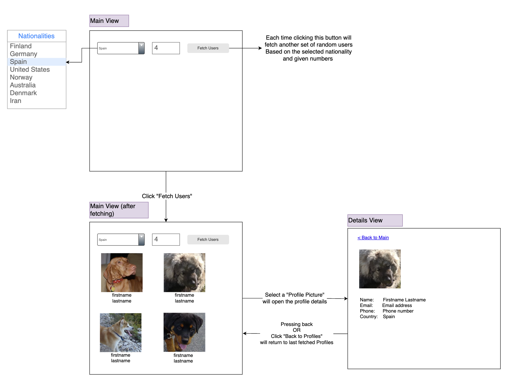

# Running the project

1. Clone the repository or download the project files from GitHub.
2. Navigate to the root directory of the project using the cd command from your terminal.
3. Make sure you have Node.js and npm installed on your system.
4. Run `npm install`.
5. Once the installation is complete, run `npm start` to start the development server.
6. Your web browser should automatically open the React application. If not, you can manually navigate to `http://localhost:3000`

# Random user and profile
The goal of this assignment is to implement a **responsive web application** in `React` + `Typescript`, to fetch random user data from `randomuser` API and join dog pictures to user profiles from [dog-images](https://dog.ceo/dog-api/) API.

## Assignment
1. Implement a responsive SPA with 2 pages/views: `main` and `details`.

2. On the `main` view user can choose a `nationality` and provide a number (i.e. `N`) as input to fetch `N` number of random users from `randomuser` API by clicking a `fetch` button.

2. Display the fetched users in a list/grid with profile picture fetched from `dog-images` API on the `main` view.

3. Selecting a ramdom user from the list of results will navigate to `details` view, where only displaying profile photo, names, email and phone number is enough.

### How to fetch the data

Random users can be fetched from `randomuser` API endpoint. For example, if you would like to fetch 4 random users of Finnish nationality, request this: https://randomuser.me/api?seed=1234579&nat=fi&results=4, where the query parameters are:
* `seed`: random seed, which makes sure that the returned user is always the same. Field accepts both numbers and strings.
* `nat`: nationality code. Accepted values are: fi/de/es/us/au/dk/ir/no
* `results`: defines how many random users to be returned

Random dog picture for each user (as profile picture) can be fetched from `dog-images` API: https://dog.ceo/api/breeds/image/random

> [!NOTE]  
> API response returns url for image, not the image itself.
>
> To fetch multiple dog images, please request this: https://dog.ceo/api/breeds/image/random/4

### Points to be noted
* Fetching of user data and dog picture should be done in parallel.
* User should be able to navigate back to `main` view from user `details` view and last fetched users should be still visible in the users list until the `fetch` button is clicked.
* Ability to add some tests within the time frame will be seen as bonus, but not required for this task.
* Please provide clear instructions on how to `run` (and `test` if there is any test provided) while submitting.

## A sample UI workflow for better understanding

## How to submit
* Create a branch from the `main` branch, where you will implement the solution.
    * Please do not make changes or push chnages in the `main` branch.
* Submit your implementation/solution by pushing changes into your branch
    * To make sure you have correct access, to commit / push / pull, please make an initial commit to your branch and push the change to repo when you receive this assignment.
    * In case of access issue, please contact immediately, so that we can fix.
* Though an experienced `React` + `Typescript` developer can implement this assignment within dedicated 5 / 6 hours, it is completely fine to take more that 5 / 6 hours to complete this task or to showcase your capabilities.
* However, we recommend to push your branch with the implementation within 6 hours of receiving the assignment and then continue working on this assignment and update the branch as required. Please note that, your access to the repository will be automatically revoked on 4 June 2024.
* Once you are done, please send us a message indicating that you have finished and ready for review.